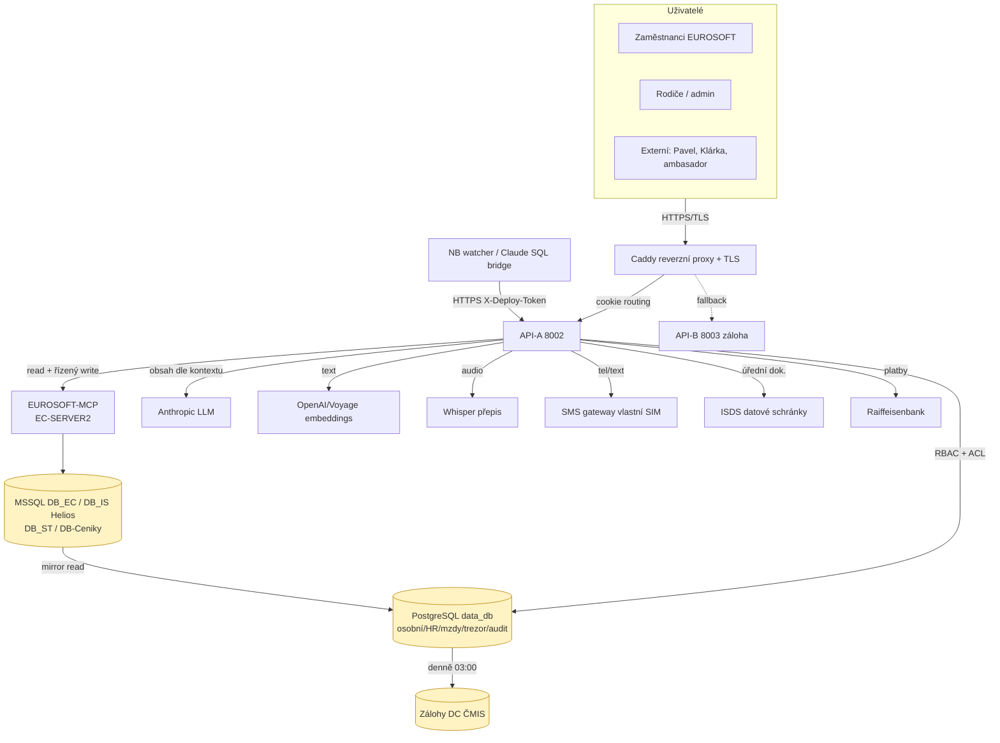

# Inventář aktiv a tok dat (ISO 27001 — A.5.9, podklad k DOC-15)

> **Verze:** 1.0 (návrh) · **Datum:** 21. 6. 2026 · **Entita:** STRATEGIE – System s.r.o.
> **Vlastník:** Marti + Claude (technika) → předáno Míse (ISMS, DOC-15) · **Klasifikace:** Interní
> **Účel:** Soupis informačních aktiv + datový tok osobních údajů systémem. Auditní podklad
> pro A.5.9 (evidence aktiv), A.5.12/5.13 (klasifikace), A.8.16 (monitoring), A.5.34 (soukromí).

---

## 1. Klasifikační schéma (A.5.12 / 5.13)

| Třída | Význam | Příklady | Ochrana |
|---|---|---|---|
| 🔴 **Citlivá** | Zvláštní kategorie / vysoké riziko | RČ, OP/pas, dětská RČ, zdravotní (neschopenky), trezor hesel, mzdy | Trezor (Fernet) / jen vlastník; HR jen v kontextu; audit přístupu |
| 🟠 **Osobní** | Běžné osobní údaje (GDPR) | Jméno, adresa, kontakt, docházka, kontakty CRM klientů | RBAC + ACL; access logy; šifr. přenos |
| 🟡 **Interní** | Provozní firemní data | Zakázky, kalkulace, účetnictví, dokumentace, ISMS | RBAC; append-only audit |
| 🟢 **Veřejná** | Určeno ke zveřejnění | Marketingový web, demo (smyšlená data) | Bez omezení |

---

## 2. Inventář aktiv — infrastruktura (A.5.9)

### 2.1 Servery / hostitelé

| Aktivum | Umístění | Role | Klasifikace dat | Vlastník |
|---|---|---|---|---|
| **Cloud APP** `10.200.188.11` | DC ČMIS (Praha, ČR) | Aplikační server (NSSM služby) | 🟠🟡 | STRATEGIE / Marti |
| **Cloud SQL** `10.200.188.12` | DC ČMIS (Praha, ČR) | PostgreSQL 16 + pgvector (`data_db`) | 🔴🟠🟡 | STRATEGIE / Marti |
| **Cloud APP-prev** (záloha) | DC ČMIS | Blue-green sekundár (API-B 8003) | 🟠🟡 | STRATEGIE / Marti |
| **EC-SERVER2** `192.168.30.11` | EUROSOFT on-prem | MSSQL (DB_EC, DB_IS/Helios, DB_ST, DB-Ceniky) + EUROSOFT-MCP | 🔴🟠🟡 | EUROSOFT |
| **NB watcher** (Claude SQL bridge) | EC-Martin / SNovotna-NTB | `STRATEGIE-CLAUDE-SQL` (forwarder) | 🟡 | Marti / Kristý |
| **Konektor Bakaláři** | NB Klárka (Nerudovka) | read-only most do školního IS (VPN) | 🟠 | Nerudovka |

### 2.2 Služby na cloud APP (NSSM)

| Služba | Funkce | Pozn. |
|---|---|---|
| `STRATEGIE-API` (8002) | Hlavní API (primár) | blue-green primary |
| `STRATEGIE-API-B` (8003) | Záloha (frozen-good) | HA fallback |
| `STRATEGIE-CADDY` | Reverzní proxy + TLS (Let's Encrypt) | XFO, routing cookie |
| `STRATEGIE-EMAIL-FETCHER` | EWS polling + outbox | 60 s |
| `STRATEGIE-TASK-WORKER` | Fronta úloh | |
| `STRATEGIE-QUESTION-GENERATOR` | Marti Memory active learning | 6 h |
| `STRATEGIE-RESTART-WATCHER` | Markery restartu + refresh zálohy | privilegované akce |

### 2.3 Datové sklady

| Sklad | Obsah | Klasifikace |
|---|---|---|
| PostgreSQL `data_db` (schémata master/tenant_group/tenant/"user"/fw/public) | Provozní data STRATEGIE: docházka, HR, mzdy, účetnictví, CRM zrcadlo, Marti-AI paměť, trezor, audit logy | 🔴🟠🟡 |
| MSSQL `DB_EC` (Centrála) | EUROSOFT CRM, zakázky, kalkulace, organizace | 🟠🟡 |
| MSSQL `DB_IS` (Helios) | Mzdy, NEMPRI přílohy, výplatnice | 🔴 |
| MSSQL `DB_ST` | Marti-AI sandbox doména | 🟡 |
| MSSQL `DB-Ceniky` | Ceníky/vzorce | 🟡 |
| Zálohy | DC ČMIS, denně 03:00 | dle zdroje |
| Trezor `tenant.user_secret` | Šifrovaná tajemství (Fernet) | 🔴 |

### 2.4 Externí služby / sub-processory (A.5.19–5.23) — podklad pro DPA

| Služba | Účel | Data, která vidí | Region |
|---|---|---|---|
| **Anthropic** (Claude API) | LLM (chat, EDI Haiku, klasifikace) | Obsah konverzací, dokumenty (dle kontextu) | US/EU |
| **OpenAI / Voyage** (embeddings) | Vektory pro RAG paměť (pgvector) | Text k embedování | US |
| **Whisper** (přepis audio) | Hlas → text (docházka, zprávy) | Audio nahrávky | dle nasazení |
| **SMS gateway** (vlastní Android SIM) | Odchozí SMS (kódy, notifikace) | Tel. číslo, text SMS | ČR (vlastní) |
| **ISDS / datové schránky** | Příjem/odeslání (ČSSZ, úřady) | Úřední dokumenty, neschopenky | ČR |
| **Raiffeisenbank** | Bankovní výpisy / EDI | Platební data | ČR |
| **DC ČMIS** | Hosting + zálohy | Vše (jako provozovatel DC) | Praha, ČR |
| **Let's Encrypt** | TLS certifikáty | Doménové jméno | EU/US |

> **Akce (T4):** ke každému uzavřít/doložit zpracovatelskou smlouvu (DPA) — viz SoA A.5.20.

---

## 3. Tok osobních údajů (data-flow, A.5.34)

**Klíčové toky osobních údajů:**
1. **Klient (CRM):** `DB_EC` (Centrála) → zrcadlo → `data_db` → UI; zápis zpět do `DB_EC` přes MCP (řízeně, audit).
2. **Zaměstnanec (HR/mzdy):** `DB_IS` (Helios) → `data_db` (docházka, mzdové podklady); self-service karta → `data_db` (primární zdroj).
3. **Citlivá (RČ/OP/pas, neschopenky, mzdy):** jen v `data_db` s tiers + access logy (`hr_sensitive_access_log`); trezor hesel šifrovaný (Fernet, klíč mimo DB).
4. **AI zpracování:** obsah konverzace/dokumentu → Anthropic (LLM) / embeddings; **AI nikdy nevidí víc, než smí uživatel** (architektonický princip + ACL).
5. **Marti-AI paměť:** `data_db` (`thoughts`), persona-owned, rodičovský přístup.

---

## 4. Vlastnictví a údržba

- **Technická aktualizace** (servery, služby, DB, externí API): Claude + Marti — průběžně z reality.
- **Klasifikace + zařazení do DOC-15** + DPA s dodavateli: Mísa (ISMS).
- **Attestace fyzické bezpečnosti** (DC ČMIS, EC-SERVER2): Marti ↔ EUROSOFT / ČMIS.
- **Revize:** při změně infrastruktury a min. 1× ročně (management review).

---

*Návrh — po doplnění klasifikace a DPA se promítne do DOC-15. Navazuje na `iso27001_dorazeni_2026.md` (§5 B12/B14) a SoA A.5.9/5.19–5.23.*
