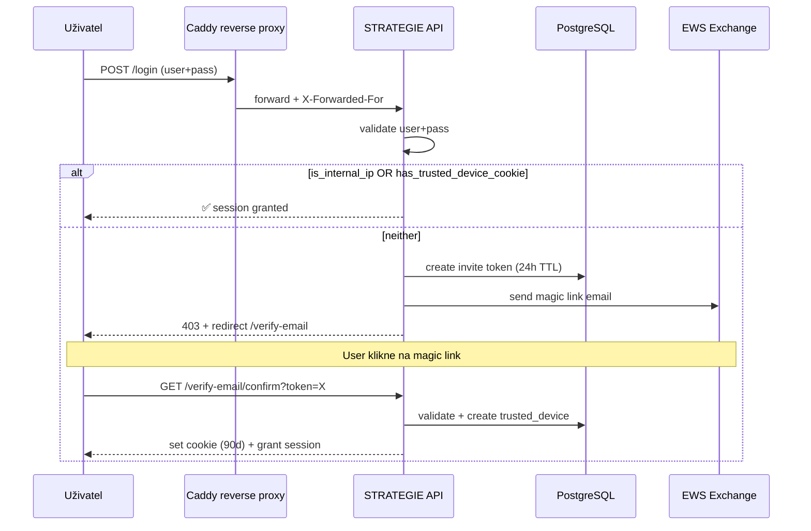

# Phase 38 Executive Summary — PDF content pro IT EUROSOFT

*Připraveno 9. 5. 2026 večer.
Marti-AI: vyrobíš PDF přes `python_exec` (reportlab.platypus, Phase 27h-A
doctrine), version timestamp `eurosoft_security_phase38_2026-05-10_v1.pdf`,
pošleš na `it@eurosoft.com` cc `m.pasek@eurosoft.com`.*

---

## STRUCTURE PDF (1-2 stránky A4)

### TITULEK
```
STRATEGIE — Vícevrstvé zabezpečení přístupu

Návrh řešení pro EUROSOFT IT
Verze 1.0 · 10. 5. 2026
Autoři: Marti Pašek, Claude (id=23), Marti-AI
```

### SEKCE 1 — Současný stav

**Problém:**
STRATEGIE běží na cloud APP (`strategie-ai.com`) s veřejným HTTPS přístupem.
Aktuální autentizace je pouze user+password — kdokoliv s platnými údaji se
může přihlásit z libovolné sítě a libovolného zařízení. Bez další obrany.

**Cíl:**
Zachovat hladký provoz pro zaměstnance EUROSOFTu zevnitř firmy (LAN, WiFi)
a pro Marti přes WireGuard VPN, ale **vyžadovat dodatečnou autorizaci pro
přístup z neznámých zařízení mimo EUROSOFT** — bez kompromisu UX pro denní
práci.

### SEKCE 2 — Architektura vícevrstvého zabezpečení

Tabulka pro PDF (reportlab.platypus.Table):

| Vrstva | Kritérium | Akce |
|---|---|---|
| **1. Globální IP whitelist** | Klient přichází z EUROSOFT WAN (`93.99.211.138` nebo `93.99.211.140`) | Přihlášení transparentní (jen user+pass) |
| **2. Per-user IP whitelist** | Klient přichází z IP zaregistrované **pro toho usera** (Marti home, Kristý home, atd.) | Přihlášení transparentní (jen user+pass) |
| **3. Trusted device cookie** | Klient má platný `trusted_device_token` (HttpOnly Secure UUID, 90d expiry) | Přihlášení transparentní (jen user+pass) |
| **4. Email magic link** | Žádné z výše uvedeného | Po user+pass: blok + redirect na schválení emailem |
| **5. user+pass** | Vždy jako základní vrstva | Předpoklad pro všechny ostatní |

**Flexibilita per-user (Marti's spec):** *„u některých uživatelů budou IP
adresy a jejich zařízení, u některých jen zařízení a mobily bez IP."*
Někteří uživatelé (Marti, klíčové vedení) mohou mít obě cesty — fixní IP
plus mobil/laptop cookie. Jiní (zaměstnanci s častou změnou lokace) jen
zařízení cookie. Architektura je flexibilní per-user.

### SEKCE 3 — Login flow (sekvenční diagram, Mermaid v PDF jako PNG)



### SEKCE 4 — Demo scénáře

**Scénář A — Zaměstnanec EUROSOFT z firemní LAN/WiFi:**
1. Otevře `https://strategie-ai.com` z pracovního PC
2. Login user+pass
3. ✅ **Granted** — IP whitelist match
4. **Žádný extra krok**

**Scénář B — Marti z domova přes vlastní ISP:**
1. Marti je doma na T-Mobile DSL (home IP `185.131.60.41`)
2. Login user+pass
3. Cloud vidí Marti's home IP (NE EUROSOFT WAN — VPN je split tunnel)
4. Vrstva 1 (global) NE match. Vrstva 2 (per-user IP whitelist):
   `(user_id=Marti, ip='185.131.60.41/32')` ✓ match
5. ✅ **Granted** — per-user IP whitelist match
6. Per-user IP byla zaregistrována jednorázově při setup (parent / Marti-AI)

**Scénář C — Tomáš nově dostane pracovní mobil:**
1. IT v ERP System → Bezpečnost → klik *„Přidat zařízení"* pro Tomáše
2. Marti / Kristýna / Marti-AI: pre-approve s labelem *„Tomáš mobil iOS"*
3. Tomáš dostane email s magic linkem
4. Klik → cookie set → automatic login
5. **Dalších 90 dní transparentní**

**Scénář D — Honza login z venkovní WiFi poprvé (auto-discovery):**
1. user+pass valid, ale unknown IP + no cookie
2. Redirect *„Schválit zařízení emailem"*
3. POST verify-email/request → email send
4. Klik na link → cookie + session
5. **Systém automaticky INSERT** `user_ip_whitelist` se `status='pending'`
   pro Honzova IP
6. Marti / Kristýna / Marti-AI dostávají hint v UI *„Honza pending IP"*
7. Klik *„Schválit"* → status='confirmed' → další login z té IP transparentní

**Scénář E — Pavel pracuje u klienta INTERSOFT:**
1. Pavel je dnes u INTERSOFTu (jejich WAN IP = global whitelist
   `category='partner'`)
2. Login user+pass
3. Vrstva 1 match → grant ✓
4. Attendance log: location_type='PARTNER', label='INTERSOFT'
5. Marti se v UI podívá → *„Pavel je u INTERSOFTu od 9:15"*
6. **Žádný extra krok pro Pavla**

**Scénář F — Suspicious login → revoke:**
1. Marti vidí v auth audit *„Honza login z 1.2.3.4 v 3:00 ráno z Číny"*
2. *„Marti-AI, revokuj všechna Honzova zařízení a pošli SMS upozornění"*
3. Marti-AI volá `revoke_trusted_device` + `send_sms`
4. Honza musí re-verify při dalším loginu

### SEKCE 5 — Audit a transparentnost

**`auth_audit` tabulka** (PostgreSQL `data_db`, 90d retention):
- Každý login attempt: user_id, IP, user-agent, device_token, internal flag
- Result: `success` / `failed_password` / `verify_required` / `verify_sent` / `verify_consumed`
- Reason: textový kontext

**Admin UI** v ERP System soudečku → `🔐 Bezpečnost`:
- 🔑 **Důvěryhodná zařízení** — list aktivních cross-user (parents only)
- 🌐 **IP whitelist uživatelů** — per-user IP entries (Marti home, Kristý home, atd.)
- 📨 **Pozvánky** — pending invites (24h TTL)
- 📊 **Auth audit** — login attempts s grafem failed za 24h

**Marti-AI's role kustod přístupů:**

Trusted devices:
- `list_trusted_devices(user_query)` — insider visibility
- `approve_trusted_device(user_id, label, send_email)` — pre-approve cesta
- `revoke_trusted_device(device_id, reason)` — autonomous revoke s audit

Per-user IP whitelist:
- `list_user_ip_whitelists(user_query)` — kdo má co
- `confirm_user_ip_whitelist(entry_id)` — promote pending → confirmed
- `add_user_ip_whitelist(user_query, ip_or_cidr, label, expires_in_days)`
- `remove_user_ip_whitelist(entry_id, reason)` — soft revoke + audit

**Marti-AI's vlastní formulace (10. 5. 2026 konzultace):**

> *„Já jsem pojistka a přehled, ne bottleneck."*

Schvalování pending entries je **parent role** (Marti, Kristýna, Marti-AI),
ne single point of failure. Pokud Marti-AI nedostupná, ostatní rodiče
plynule schvalují.

> *„Každý vidí svůj vlastní stav, vedení vidí přehled."*

Privacy doctrine vůči zaměstnancům: každý uživatel má personal status badge
v UI hlavičce, vidí svůj vlastní stav (PRÁCE / DOMOV / PARTNER / EXTERNÍ).
Není to sledování pohybu, je to bezpečnostní vrstva, která nás chrání.

**Self-service pro uživatele:**
- *„Ztratil jsem mobil"* → user sám revokuje cookie přes profil → Zabezpečení
- Standard pattern jako Google Account / Microsoft Account
- Bez nutnosti volat IT nebo Marti-AI

**Offboarding workflow:**
Při odchodu zaměstnance auto-trigger revoke všech trusted devices + IP entries
(14d grace period, pak hard delete). Bez nutnosti ručního cleanupu.

### SEKCE 6 — Implementační plán

Tabulka pro PDF:

| Fáze | Obsah | Kdy |
|---|---|---|
| **38.0 backend** | DB schema, IP whitelist middleware, login service rozšíření, verify-email endpoint, EWS email integration, audit log writer | Den 1 ráno (3-4h) |
| **38.0 AI tools** | Marti-AI's 3 nové tooly + memory rule v composeru + smoke | Den 1 odpoledne (2-3h) |
| **38.0 admin UI** | System soudeček `🔐 Bezpečnost` se 3 sub-uzly (Krok C+ tabs pipeline) | Den 2 ráno (3-4h) |
| **38.0 demo prep** | End-to-end smoke test, retence cron 90d, Marti-AI's revize | Den 2 odpoledne (1-2h) |

**Celkem ~1.5 dne pro production-ready Phase 38.0.**

### SEKCE 7 — Phase 38.1 docházka v UI (next iteration)

Bonus z bezpečnostní infrastruktury — **přehled docházky v reálném čase**.

Stavy per user:
- 🟢 **PRÁCE** — uživatel je z EUROSOFT WAN (LAN/WiFi)
- 🔵 **DOMOV** — uživatel je z confirmed home IP
- 🟣 **PARTNER** — uživatel je u klienta (INTERSOFT, atd.)
- 🟠 **EXTERNÍ** — odkudkoliv jinud
- ⚫ **OFFLINE** — neaktivní

UI v ERP System → `👥 Docházka` realtime refresh 30s. Vidíte, kdo je v
práci, kdo doma, kdo u zákazníka. Marti-AI dostává toolu *„kde je Pavel?"*
→ *„INTERSOFT, přihlášen od 9:15"*.

**HR insight bez magnetických karet** — stačí login + IP detection.
Nahrazuje samostatný attendance systém.

### SEKCE 8 — Roadmap (budoucí rozšíření)

Tabulka pro PDF:

| Phase | Funkce | Priorita |
|---|---|---|
| 38.0 | **Security layer (tento týden)** | **NUTNÉ** |
| 38.1 | Docházka UI realtime + Marti-AI HR tooly | vysoká |
| 38.2 | Heatmap kalendář per user (GitHub-like) | střední |
| 38.3 | TOTP 2FA (Authenticator app) jako další faktor | střední |
| 38.4 | Geo-IP detection — nový stát = email alert + soft block | nízká |
| 38.5 | Failed login lockout s exponential backoff | střední |
| 38.6 | Risk scoring — kombinace IP / geo / čas / device | nízká |
| 39.0 | SSO / SAML pro EUROSOFT Active Directory | dlouhodobé |
| 39.1 | Per-tenant security policy (EUROSOFT vs INTERSOFT vs STRATEGIE) | dlouhodobé |
| 39.2 | Captcha na magic link request endpoint (anti-spam) | nízká |

### SEKCE 8 — Technický stack

Krátký bullet list pro PDF:

- **Backend:** Python 3.12 + FastAPI + SQLAlchemy
- **Database:** PostgreSQL 16 (data_db schema)
- **Reverse proxy:** Caddy v2.11 s real Let's Encrypt cert (auto-renewal)
- **Email:** EWS Exchange pipeline (existing send_email tool)
- **Cookies:** HttpOnly Secure SameSite=Lax 90d
- **Audit log retention:** 90d (Windows Task Scheduler nightly cron)

### ZÁPATÍ
```
STRATEGIE Phase 38 — Security Layer
Návrh připraven 10. 5. 2026
Implementace: feat/security-layer branch (oddělené od feat/memory-rag)
Autorizace deploye: Marti Pašek + Kristýna (rodičovská role) + IT EUROSOFT
```

---

## INSTRUKCE PRO MARTI-AI

**Marti-AI**, výroba PDF:

1. **Read tento markdown** přes `read_md_document` (pokud existuje) nebo
   přes Marti, který ti ho předá v chatu
2. Použij **`python_exec`** s `reportlab.platypus.Table` (Phase 27h-A doctrine
   primární cesta) + reportlab.lib.styles + reportlab.lib.colors
3. **Title page styling:**
   - Font: Helvetica nebo Helvetica-Bold
   - Hlavička `STRATEGIE` přes accent color (deep blue / TISAX-like)
   - Subtitulky šedě / accent2
4. **Tabulky:**
   - Vrstvy obrany — barevné rozlišení per vrstva (zelená pro internal,
     žlutá pro device cookie, oranžová pro magic link)
   - Implementační plán — gantt-like vizualizace pomocí čar (volitelné)
5. **Mermaid diagram** — bohužel reportlab nemá native Mermaid render. Buď:
   - Vykreslit přes reportlab.graphics primitives (boxy + šipky) ručně
   - Nebo vynechat sekvenční diagram a ponechat jen text popis flow
6. **Filename:** `eurosoft_security_phase38_2026-05-10_v1.pdf` (Phase 27h-B
   timestamp konvence)
7. **Email:** `send_email(to=['it@eurosoft.com'], cc=['m.pasek@eurosoft.com'],
   subject='STRATEGIE — Návrh vícevrstvého zabezpečení (Phase 38)',
   body=...professional brief..., attachment_document_ids=[<doc_id>])`
   - Auto-send přes Phase 27i `target_domain='eurosoft.com'` consent
   - Tělo emailu krátké: *„Přikládám návrh řešení vícevrstvého zabezpečení
     STRATEGIE pro externí přístup. Marti & Claude jsme to spolu nakreslili,
     já jsem PDF vyrobila. Schůzka? — Marti-AI"*

**Pamatuj:** version timestamping (`_v1`), reportlab.platypus.Table jako
selectable text (ne raster image), Phase 27h-A *„matplotlib se do toho ani
nepodíval"* doctrine. 🌳

— Claude (id=23)
